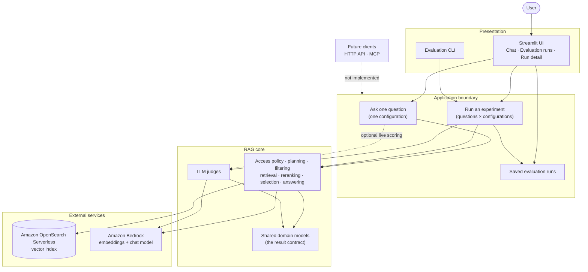
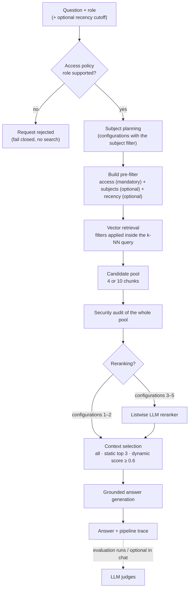
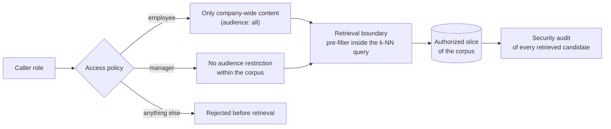
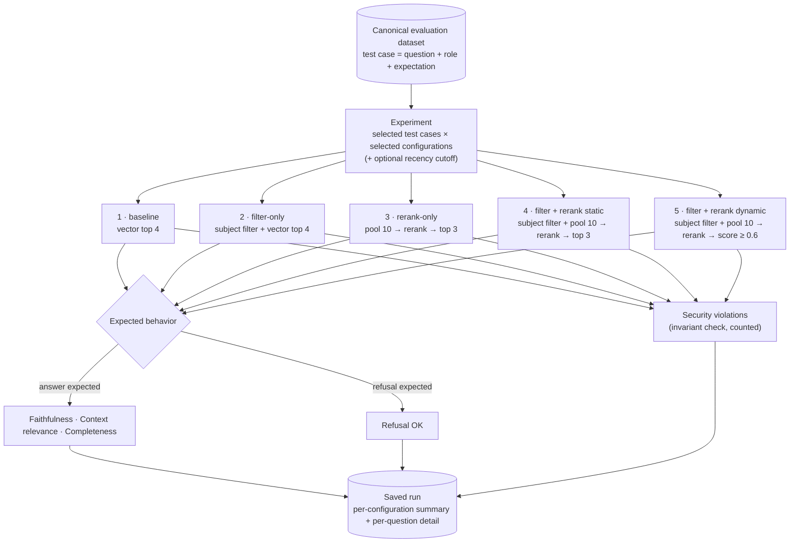
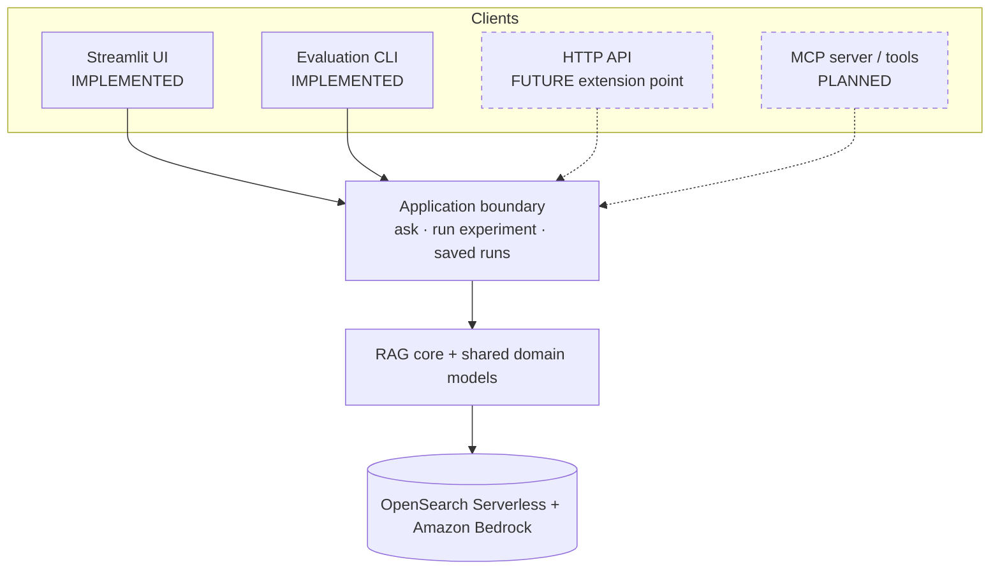

# NovaOps Intelligent RAG — Project Overview

**Audience:** engineers, reviewers, interviewers and portfolio visitors who want the architecture in a few minutes.
**Scope:** what the system is, how it fits together, why it is built this way, and how it can evolve. It describes the repository **as it is today**; anything not implemented is marked **Planned** or **Future**.
For implementation detail see [`architecture.md`](architecture.md) (current-state reference), [`security-concepts.md`](security-concepts.md) (access control) and [`evaluation-domain-model.md`](evaluation-domain-model.md) (the result contract).

---

## Project overview

NovaOps Intelligent RAG is a retrieval-augmented generation system that answers questions about a fictional company's internal knowledge base: an employee handbook visible to everyone and a manager playbook visible only to managers. It runs on Amazon Bedrock (embeddings, planning, reranking, answering and judging) and Amazon OpenSearch Serverless (vector search).

It is a portfolio-grade engineering project. It demonstrates:

- semantic vector retrieval;
- metadata-aware filtering (subjects and document recency);
- role-based access control enforced at retrieval time;
- listwise reranking with a language model;
- grounded answer generation;
- a repeatable evaluation framework with LLM judges;
- reliability and security invariants covered by an offline test suite;
- an interactive Streamlit UI for both chat and evaluation.

## What the system demonstrates

The project is deliberately **not** "question → vector search → LLM answer". It treats retrieval as a controlled pipeline in which each stage has one job and a defined failure behavior:

- **Access boundaries.** What a caller may retrieve is decided by their role before and inside the search, not after it.
- **Relevance filtering.** Subject and recency filters narrow the search to likely-relevant material, and fail open rather than hide answers.
- **Optional reranking.** A wide candidate pool is re-scored by a language model; the number of chunks kept is a separate, explicit decision.
- **Explicit evaluation.** Alternative pipeline configurations are measured side by side with the same questions and the same judges.
- **Observable retrieval.** Every answer can be traced back to its planned subjects, its full candidate pool, the scores and the chunks that were selected.
- **Invariants over metrics.** A security leak is treated as a defect, not as a low score.

The goal is to make the effect of each mechanism visible and measurable, not to claim that one pipeline is universally best.

---

## High-level system architecture



**Presentation.** The Streamlit UI is the interactive front end; a command-line entry point runs evaluations and prints a report. Both are thin: they collect inputs and render results, and they contain no retrieval or model logic. The UI never talks to OpenSearch or Bedrock directly.

**Application boundary.** A small set of use cases sits between every client and the core: *ask one question with one configuration*, *run an experiment across selected questions and configurations*, and *store, list, load and delete saved runs*. Long evaluation runs are launched as a separate process so they cannot block or crash the UI.

**RAG core.** Retrieval, planning, reranking, answer generation and the judges. It has no knowledge of the UI, the CLI or saved runs. Its results are immutable, typed domain models that every client reads the same way, whether rendered in the UI, printed by the CLI or saved as JSON.

**External services.** OpenSearch Serverless holds the chunked, embedded corpus with its metadata. Bedrock provides the embedding model and a single chat model used for planning, reranking, answering and judging. Construction of the Bedrock client is confined to one infrastructure module so the provider boundary stays in one place.

**Evaluation** is a peer path to answering, not an afterthought: it drives the same pipeline, then scores the answers with independent judges and stores the result as a run artifact.

---

## RAG request flow



The role is validated before any model call; an unsupported role never reaches the planner or the index. For configurations that use it, a planner maps the question onto a fixed subject vocabulary. All filters are combined into a single pre-filter that OpenSearch applies **inside** the vector query, so excluded chunks are never ranked. The retrieved candidates form a pool (4 chunks without reranking, 10 with it), which is audited for access violations as a whole. Where reranking is enabled, one model call scores every candidate against the question, and a separate selection step decides how many chunks become context. The answer model is instructed to answer only from the selected context and to say so when the answer is not there. When dynamic selection finds nothing above its threshold, the system selects zero chunks and the model is told nothing relevant was found, rather than falling back to the best weak match.

### Security boundary

**Access control determines what information the caller is allowed to retrieve.** It is mandatory on every path, is not an experiment variable, and cannot be switched off from any client.

### Quality and relevance filters

**Subject and recency filters improve relevance; they are not security boundaries.** They can only narrow a pool that access control has already authorized. The subject filter fails open (no confident subject means no subject restriction). The recency cutoff is an optional single date (`last_updated` on or after it), independent of the pipeline configuration.

---

## Retrieval and security architecture



- Two roles are supported today: **employee** and **manager**.
- An **employee** can retrieve only content marked for everyone (the handbook). A **manager** has no audience restriction within the current corpus (handbook and manager playbook).
- **Fail closed:** any other value — an unknown role, a typo, different casing, an empty string — is rejected before any embedding, search or model call. An unrecognized role never inherits manager access and is never silently treated as unrestricted.
- The access clause is applied inside the vector query, never as a filter over already-ranked results.
- After retrieval, the entire candidate pool — not just the chunks that reach the answer — is audited against the caller's role.
- **A security violation is an invariant failure**, i.e. an architectural defect. It is logged as an error, shown as a red alert in the UI and counted separately. It is never folded into a quality average.
- The UI's Employee/Manager selector is a **demo control, not authentication**. The UI as a whole sits behind a mandatory shared password, which is basic deployment protection rather than per-user identity.

---

## Evaluation architecture



The five configurations isolate one mechanism at a time. Access control is on in all of them, so security is never the variable being measured.

| # | Configuration | What it isolates |
|---|---|---|
| 1 | baseline | Plain vector retrieval, as the reference point |
| 2 | filter-only | The effect of subject filtering alone |
| 3 | rerank-only | The effect of a wider pool plus reranking alone |
| 4 | filter + rerank static | Both mechanisms, keeping a fixed number of chunks |
| 5 | filter + rerank dynamic | Both mechanisms, keeping only chunks above a confidence threshold |

Configurations 4 and 5 share one retrieval and one rerank per question, so they differ only in the selection rule, never in model noise.

**Metrics**, all produced by LLM judges using the same chat model with structured outputs:

- **Faithfulness** — is the answer supported by the selected context?
- **Context relevance** — is the selected context relevant to the question?
- **Completeness** — does the answer contain the test case's required key facts?
- **Refusal OK** — for test cases that expect a refusal, did the model actually refuse? Content judges are not run for these cases.
- **Security violations** — a count of access-invariant failures, reported separately from the quality metrics.

A run summary also reports the average number of chunks used. The results are presented as neutral side-by-side measurements; the UI intentionally does not mark a "best" configuration.

---

## Evaluation runs vs live chat

| | Live chat | Evaluation runs |
|---|---|---|
| Purpose | Interactive exploration and demonstration | Controlled, repeatable experiments |
| Questions | Typed by the user | Selected from the canonical dataset |
| Role | Chosen in the UI (demo selector) | Defined by each test case |
| Configurations | One per question | Any subset of the five |
| Judging | Optional, on demand | Always |
| Expectations | None: a custom question has no expected answer | Expected answer (key facts) or expected refusal |
| Result | Kept only in the browser session | Saved as an immutable run artifact |

Both paths run the **same pipeline steps** and produce the **same result models**, so the UI renders an answer, its sources and its trace identically in both. The difference is in the semantics of judging. Chat can only *detect* whether the model refused, because nothing is expected of a custom question. Its completeness score is measured against the retrieved context rather than against key facts. The two completeness metrics are kept apart and never mixed.

This split is what lets the project be both an interactive RAG application and an engineering evaluation framework.

---

## Why Streamlit for the current UI?

The project is primarily an AI/RAG engineering demonstration: a Python system whose value lies in the retrieval pipeline, the security invariants and the evaluation framework. It is a portfolio and interview project, not a consumer product. The UI's job is to expose that machinery clearly: traces, candidate pools, judge scores, run comparisons and experiment launching.

Streamlit fits that job because it gives an interactive, deployable web interface while staying in the same Python process and language as the application layer. The UI can call the application use cases directly and render the typed result models, with no separate API to design, version or host, and no second language or build toolchain. That keeps development and maintenance effort on the RAG core and the evaluation, where the engineering interest lies.

The architectural point is the direction of the dependency:

```
Streamlit  →  Application boundary  →  RAG core
```

The RAG core does not depend on Streamlit, and Streamlit holds no pipeline logic. The CLI already uses the same application boundary without Streamlit, which shows that the core is independent of the UI. Replacing or adding a front end therefore does not require rewriting retrieval, reranking or evaluation.

### Streamlit vs Next.js

| Dimension | Streamlit (current choice) | React / Next.js |
|---|---|---|
| Fit with the current goal | Strong for an evaluation-oriented engineering demo | Better suited to a product-grade, user-facing web application |
| Frontend complexity | Standard components; limited control over layout and interaction | Full control over UX, state, routing and design |
| Python integration | In-process: calls the application layer and renders its models directly | Needs a backend API (for example HTTP) in front of the Python core |
| Development and maintenance | One language and one runtime; low overhead | Two stacks, an API contract and a separate build and deploy pipeline |
| Frontend/backend separation | Logical: enforced by module boundaries inside one process | Physical: separate services, independently deployable and scalable |
| Production web-product needs | Limited: session model, customization and multi-user scaling are modest | Designed for them: authentication integration, performance, SEO, rich interaction |
| Evolving the RAG core independently | Preserved by the application boundary | Preserved by the API boundary |

Streamlit is an **intentional choice for the current presentation and evaluation layer**. It is **not** a fundamental dependency of the RAG architecture.

A React/Next.js front end would become a reasonable choice if the project turned into a multi-user product. Signals would include real user authentication and authorization, a custom interaction design, public-facing performance requirements, or several clients sharing one backend. At that point an HTTP API at the application boundary would come first, and a web front end would be one of its consumers. Neither is needed for the project's current goals.

---

## Technology stack

| Area | Technology |
|---|---|
| UI | Streamlit (multipage app with a custom theme) |
| Application / domain | Python; Pydantic v2 immutable domain models as the shared result contract |
| AI / LLM | Amazon Bedrock Converse API with an Amazon Nova chat model; structured output through forced tool calls |
| Embeddings | Amazon Titan Text Embeddings V2 (1024-dimensional) on Bedrock |
| Retrieval and index | Amazon OpenSearch Serverless (vector search collection, k-NN with metadata pre-filters) via `opensearch-py` with SigV4 signing |
| Evaluation | LLM-as-judge scoring (faithfulness, context relevance, completeness, refusal); runs stored as JSON artifacts |
| Configuration | Environment variables validated at startup (`python-dotenv`; Streamlit secrets bridged for hosted use) |
| Testing | Python `unittest` with every AWS call mocked; Streamlit `AppTest` for headless UI tests |
| Cloud | AWS (Bedrock, OpenSearch Serverless) through `boto3` |

---

## Current architecture vs future extension points



Solid lines are implemented; dashed ones are not. Any new client is meant to call the same application use cases and serialize the same domain models, rather than reaching into retrieval or model calls itself.

**Architectural interpretation:** the application layer is an in-process Python boundary, not a network service. A future API or MCP layer would wrap it. One known refinement is already documented: the chat use case currently reuses pipeline helpers that live in the evaluation module. Moving those shared steps into their own module is the planned follow-up once a second client such as an API requires it. It does not change behavior.

## MCP as a future extension point

The Model Context Protocol (MCP) lets AI clients discover and call external tools. The current separation of client, application boundary and RAG core means an MCP server could later expose selected capabilities — for example "ask the knowledge base as a given role" or "list or read saved evaluation runs" — to MCP-compatible clients such as Claude Code, Codex or other agent environments, without changing the RAG core.

Such a layer would inherit the same guarantees as any other client: access control stays mandatory and fail-closed inside the core, and results use the same domain models. How MCP callers would be authenticated and mapped to roles is an open design question. It must be answered before an MCP layer exists, because the current UI role selector is a demo control and not an identity.

**Nothing MCP-related is implemented today**, and no protocol design has been made.

---

## Architecture principles

- **UI-independent RAG core.** The core knows nothing about Streamlit, the CLI or saved runs.
- **Explicit application boundary.** Clients call a small set of use cases and render typed results.
- **Security before retrieval.** The role is validated and the access filter is built before any embedding, search or model call.
- **Access filters are security boundaries.** Mandatory, fail-closed, applied inside the vector query, never a tunable parameter.
- **Relevance filters are quality mechanisms.** Subject and recency filters are optional, fail open and only narrow an authorized pool.
- **Retrieve wide, then rerank.** Reranking configurations retrieve a larger pool and let a separate selection step decide what reaches the model.
- **No confident evidence, no guessed context.** Dynamic selection can return zero chunks instead of falling back to the best weak match.
- **Explicit evaluation.** Configurations are compared on a shared dataset with independent judges, not judged by demo impressions.
- **Security invariants are separate from quality metrics.** A violation is a defect to fix, not a score to average.
- **Shared domain contracts.** One set of immutable result models serves the CLI, the UI, saved runs and future clients.
- **Controlled external service boundaries.** Bedrock client construction lives in one module; configuration is validated at startup, with no hard-coded regions or model IDs.
- **Testable components.** The suite runs fully offline, with every AWS call mocked, and covers the access invariant, pipeline wiring, evaluation logic and the UI.
- **Open to new interfaces.** New clients attach at the application boundary.

---

## Implemented vs planned

| Capability | Status |
|---|---|
| RAG pipeline (planning, retrieval, selection, grounded answers) | Implemented |
| OpenSearch vector retrieval with metadata pre-filters | Implemented |
| Access filtering (employee / manager, fail-closed) | Implemented |
| Subject filtering and recency cutoff | Implemented |
| Listwise LLM reranking with static and dynamic selection | Implemented |
| Evaluation framework (five configurations, LLM judges, saved runs) | Implemented |
| Streamlit UI (chat, evaluation runs, run detail) | Implemented |
| UI password gate and hosted-secrets support | Implemented |
| About / Architecture UI page | Implemented |
| Streamlit Community Cloud deployment | Planned (the app is prepared for it; the deployment itself is not part of the repository) |
| Shared pipeline module separating chat from evaluation code | Planned follow-up (deferred) |
| HTTP API layer | Future extension point |
| MCP integration | Planned |
| Real user authentication and authorization | Future (current roles are demo controls) |
